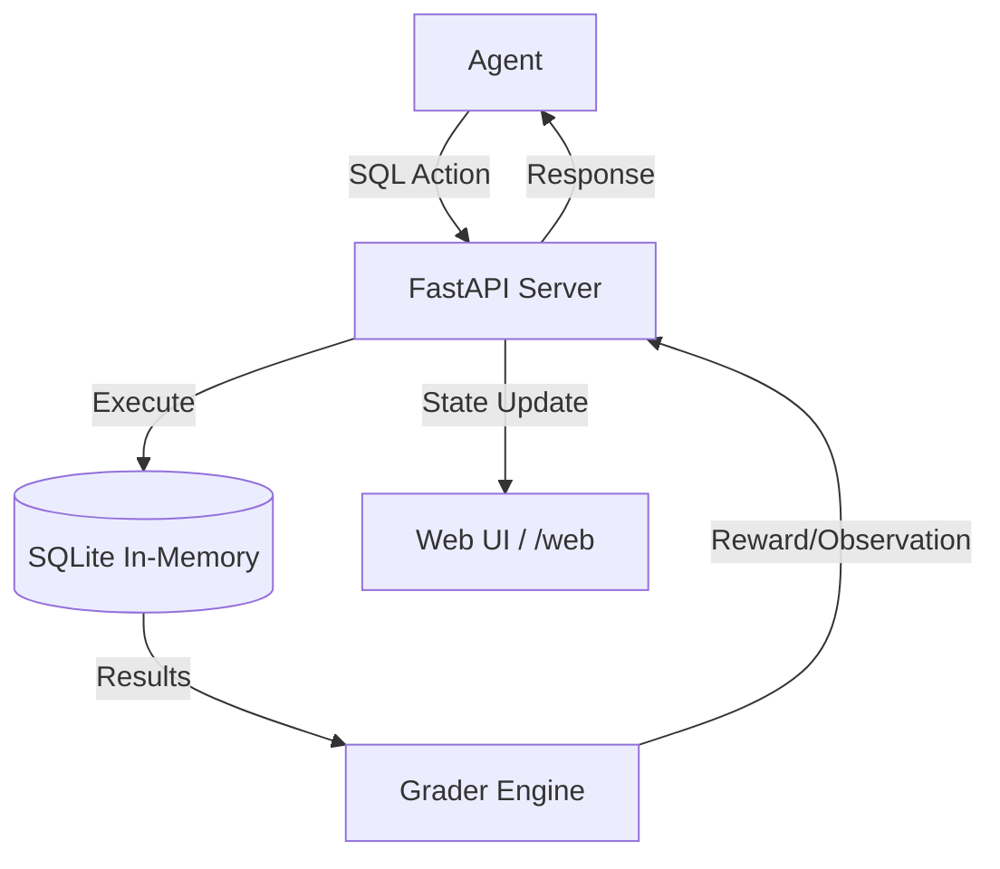

# 🗄️ DriftFix: Schema Migration Environment

[](https://github.com/openenv-core)
[](https://opensource.org/licenses/MIT)

**DriftFix** is a high-fidelity Reinforcement Learning (RL) environment designed to train and evaluate AI agents on real-world database schema migration tasks. Built for the **Meta PyTorch OpenEnv Hackathon**, it challenges agents to diagnose broken schemas from failing query results and issue precise SQL DDL/DML statements to restore system health.

---

## 🚀 Why DriftFix?

Database migrations are inherently high-stakes. A single flawed `ALTER TABLE` or `DROP` can lead to data loss or service outages. DriftFix provides a sandboxed, deterministic environment where agents can:

- **Diagnose** structural issues from raw SQL error messages.
- **Plan** complex multi-step migrations (e.g., normalization).
- **Execute** DDL/DML safely using an in-memory SQLite backend.
- **Verify** success through a suite of passing target queries.

---

## 🛠️ System Architecture



---

## 🏁 Quick Start

### Installation

```bash
# Clone the repository
git clone https://github.com/mohdaltamish/DriftFix.git
cd DriftFix

# Install dependencies
pip install -e .
```

### Basic Usage

```python
import asyncio
from schema_migration_env import SchemaMigrationEnv, SchemaMigrationAction

async def main():
    # Start environment via Docker
    env = await SchemaMigrationEnv.from_docker_image("driftfix-env")
    
    # Reset to a specific task
    result = await env.reset(task_id="add_missing_column")
    print(f"Task: {result.observation.task_description}")
    
    # Take an action
    action = SchemaMigrationAction(
        sql="ALTER TABLE employees ADD COLUMN salary INTEGER DEFAULT 60000;",
        action_type="execute"
    )
    step = await env.step(action)
    print(f"Reward: {step.reward} | Done: {step.done}")
    
    await env.close()

asyncio.run(main())
```

---

## 📊 Evaluation Benchmark

DriftFix features three core tasks of increasing complexity:

| Task ID | Difficulty | Target Queries | Focus Area |
| :--- | :--- | :---: | :--- |
| `add_missing_column` | **Easy** | 2 | Schema discovery & basic DDL |
| `normalize_table` | **Medium** | 3 | Data restructuring & FK management |
| `breaking_version_migration` | **Hard** | 5 | Data preservation during breaking changes |

### Baseline Scores (Success Rate)

| Model | Easy | Medium | Hard |
| :--- | :---: | :---: | :--- |
| **GPT-4o** | 92% | 78% | 65% |
| **Qwen2.5-72B** | 85% | 71% | 58% |
| **Random Agent** | 5% | 2% | 1% |

---

## 💎 Features

### 🖥️ Modern Web UI
DriftFix includes a built-in **Glassmorphism Web Dashboard** accessible at `/web`. It provides real-time visualization of:
- Current Database Schema (DDL dump)
- Live Query Pass/Fail status
- Agent Progress & Cumulative Rewards

### ⚡ Persistent Sessions
Leverage **WebSockets (`/ws`)** for high-frequency agent interaction, reducing HTTP overhead and enabling real-time observability.

### 🛡️ Safety Engine
The environment includes a `Destructive Action` detector that penalizes agents for `DROP TABLE` or `DELETE` operations that result in unrecoverable data loss in tables containing critical data.

---

## 📈 Reward Function

The reward system is designed to encourage both correctness and efficiency:

$$R = \text{Progress Bonus} + \text{Completion Bonus} + \text{Efficiency Bonus} - \text{Penalties}$$

- **Progress Bonus (+0.4 per $\Delta$query)**: Awarded for each new target query that starts passing.
- **Completion Bonus (+0.3)**: Awarded when all target queries pass.
- **Efficiency Bonus (+0.0 to +0.2)**: Proportional to remaining steps upon completion.
- **SQL Error Penalty (-0.05)**: Applied for invalid SQL syntax.
- **Destructive Action (-0.30)**: High penalty for unrecoverable data loss.
- **Step Cost (-0.01)**: To discourage loops and favor shorter paths.

---

## ⚙️ Configuration

| Variable | Default | Description |
| :--- | :--- | :--- |
| `HF_TOKEN` | Required | Hugging Face API token for inference |
| `MODEL_NAME` | `Qwen/Qwen2.5-72B-Instruct` | LLM used by `inference.py` |
| `IMAGE_NAME` | Required | Docker image name for `inference.py` |
| `API_BASE_URL` | `https://router.huggingface.co/v1` | LLM Gateway URL |

---

## 📄 License

This project is licensed under the MIT License - see the [LICENSE](LICENSE) file for details.

---

<p align="center">
  Developed with ❤️ for the Meta OpenEnv Hackathon
</p>
